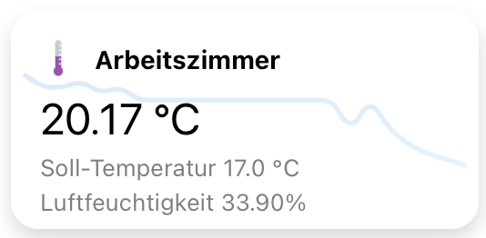

<h1 align="center">🎨 custom openHAB widgets 📈</h1>

  A small hacky collection of my own custom openHAB widgets.

This repository contains some of the custom widgets used in my openHAB config.
Widgets might be buggy, don't work or kill your cat. I'm no responsible for any
kind of these bugs.

## 📦 Requirements

- openHAB (>= 3.X) with the new UI

## 📝 Table of contents

- [Advanced Heating Cell](#advanced-heating-cell)

## 🚀 Usage

- copy the content of the yaml files in the relating directory to a new widget
- use the widgets in your pages
- come back to the short documentation in case anything went wrong

## Advanced Heating Cell

This widget displays some details from the models created out of tado thermostats.
Required properties are `_TargetTemperature`, `_Humidity` and `_Temperature` points
for the selected model. When clicking on the cell, a popup modal with a knob appears
in which the target temperature can be adjusted.

## 📝 License

These widgets are licensed under the BEERWARE license.

"THE BEER-WARE LICENSE" (Revision 42):
As long as you retain this notice you can do whatever you want with this stuff. 
If we meet some day, and you think this stuff is worth it, you can buy me a beer 
in return.
